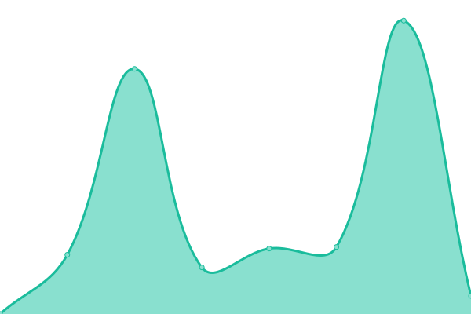

# [📈 Live Status](https://FootprintLab.github.io/api-health): <!--live status--> **🟧 Partial outage**

This repository contains the open-source uptime monitor and status page for [FootprintLab](https://FootprintLab.github.io/api-health), powered by [Upptime](https://github.com/upptime/upptime).

With [Upptime](https://upptime.js.org), you can get your own unlimited and free uptime monitor and status page, powered entirely by a GitHub repository. We use [Issues](https://github.com/FootprintLab/api-health/issues) as incident reports, [Actions](https://github.com/FootprintLab/api-health/actions) as uptime monitors, and [Pages](https://FootprintLab.github.io/api-health) for the status page.

<!--start: status pages-->
<!-- This summary is generated by Upptime (https://github.com/upptime/upptime) -->
<!-- Do not edit this manually, your changes will be overwritten -->
<!-- prettier-ignore -->
| URL | Status | History | Response Time | Uptime |
| --- | ------ | ------- | ------------- | ------ |
|  Activity Units | 🟩 Up | [activity-units.yml](https://github.com/FootprintLab/api-health/commits/HEAD/history/activity-units.yml) | 

 1745ms
     
 | 

<a href="https://FootprintLab.github.io/api-health/history/activity-units">99.66%</a>
    

|  Activity Classification Systems | 🟩 Up | [activity-classification-systems.yml](https://github.com/FootprintLab/api-health/commits/HEAD/history/activity-classification-systems.yml) | 

 3269ms
     
 | 

<a href="https://FootprintLab.github.io/api-health/history/activity-classification-systems">98.85%</a>
    

|  Levels | 🟥 Down | [levels.yml](https://github.com/FootprintLab/api-health/commits/HEAD/history/levels.yml) | 

 460ms
     
 | 

<a href="https://FootprintLab.github.io/api-health/history/levels">0.00%</a>
    

|  Sources | 🟩 Up | [sources.yml](https://github.com/FootprintLab/api-health/commits/HEAD/history/sources.yml) | 

 636ms
     
 | 

<a href="https://FootprintLab.github.io/api-health/history/sources">99.66%</a>
    

|  Regions | 🟩 Up | [regions.yml](https://github.com/FootprintLab/api-health/commits/HEAD/history/regions.yml) | 

 620ms
     
 | 

<a href="https://FootprintLab.github.io/api-health/history/regions">99.66%</a>
    

|  Countries | 🟩 Up | [countries.yml](https://github.com/FootprintLab/api-health/commits/HEAD/history/countries.yml) | 

 493ms
     
 | 

<a href="https://FootprintLab.github.io/api-health/history/countries">99.66%</a>
    

|  Impact Categories | 🟩 Up | [impact-categories.yml](https://github.com/FootprintLab/api-health/commits/HEAD/history/impact-categories.yml) | 

 576ms
     
 | 

<a href="https://FootprintLab.github.io/api-health/history/impact-categories">99.66%</a>
    

|  Metrics | 🟥 Down | [metrics.yml](https://github.com/FootprintLab/api-health/commits/HEAD/history/metrics.yml) | 

 484ms
     
 | 

<a href="https://FootprintLab.github.io/api-health/history/metrics">0.00%</a>
    

|  Scopes | 🟥 Down | [scopes.yml](https://github.com/FootprintLab/api-health/commits/HEAD/history/scopes.yml) | 

 566ms
     
 | 

<a href="https://FootprintLab.github.io/api-health/history/scopes">0.00%</a>
    

|  Countries | 🟩 Up | [countries.yml](https://github.com/FootprintLab/api-health/commits/HEAD/history/countries.yml) | 

 493ms
     
 | 

<a href="https://FootprintLab.github.io/api-health/history/countries">99.66%</a>
    

|  Footprint Free | 🟥 Down | [footprint-free.yml](https://github.com/FootprintLab/api-health/commits/HEAD/history/footprint-free.yml) | 

 1157ms
     
 | 

<a href="https://FootprintLab.github.io/api-health/history/footprint-free">0.00%</a>
    

|  Footprint Bronze | 🟥 Down | [footprint-bronze.yml](https://github.com/FootprintLab/api-health/commits/HEAD/history/footprint-bronze.yml) | 

 713ms
     
 | 

<a href="https://FootprintLab.github.io/api-health/history/footprint-bronze">1.08%</a>
    

|  Footprint Silver | 🟥 Down | [footprint-silver.yml](https://github.com/FootprintLab/api-health/commits/HEAD/history/footprint-silver.yml) | 

 655ms
     
 | 

<a href="https://FootprintLab.github.io/api-health/history/footprint-silver">0.00%</a>
    

|  Footprint Gold | 🟥 Down | [footprint-gold.yml](https://github.com/FootprintLab/api-health/commits/HEAD/history/footprint-gold.yml) | 

 623ms
     
 | 

<a href="https://FootprintLab.github.io/api-health/history/footprint-gold">0.00%</a>
    

<!--end: status pages-->

[**Visit our status website →**](https://FootprintLab.github.io/api-health)

## 📄 License

- Powered by: [Upptime](https://github.com/upptime/upptime)
- Code: [MIT](./LICENSE) © [Anand Chowdhary](https://anandchowdhary.com), supported by [Pabio](https://pabio.com)
- Data in the `./history` directory: [Open Database License](https://opendatacommons.org/licenses/odbl/1-0/)
